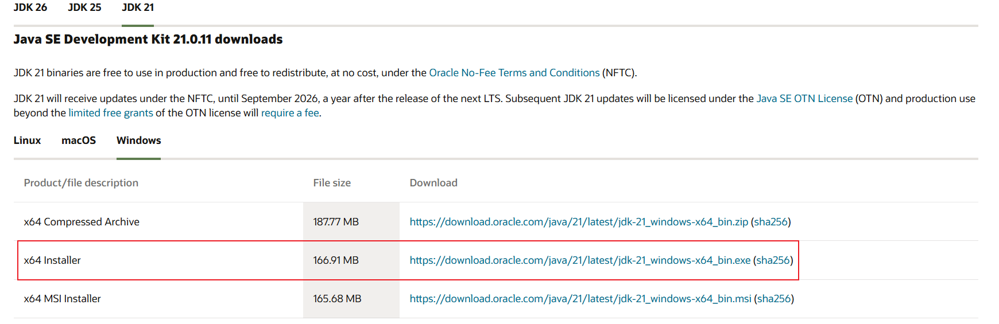
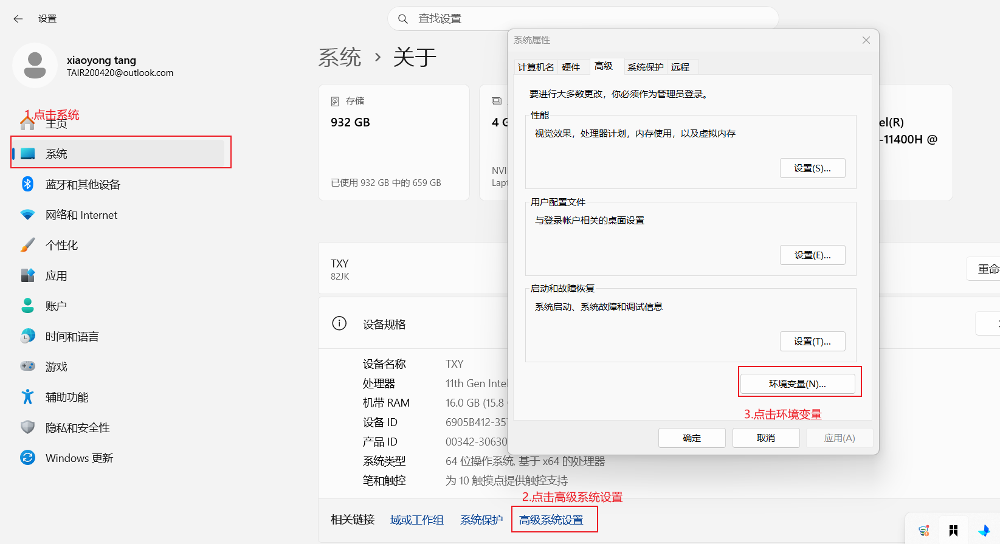
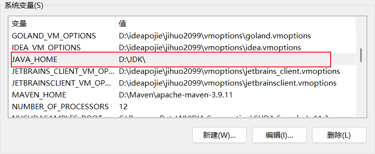
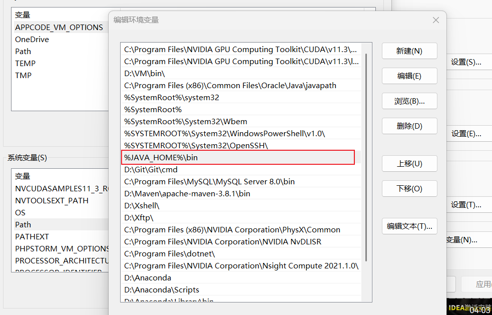

# JDK的安装

---

> 在学习 Java 开发之前，首先需要在本地计算机上安装 JDK（Java Development Kit，Java 开发工具包）。JDK 包含了 Java 运行时环境（JRE）、编译器（javac）、调试工具以及核心类库，是编写、编译和运行 Java 程序的基础。
>
> 本文档将介绍如何在不同操作系统（Windows / macOS / Linux）上下载、安装 JDK，并配置环境变量，以便在命令行中全局使用 `java` 和 `javac` 命令。

jdk的下载其实非常简单，我将进行分步说明：

进入oracle官网

官网地址：https://www.oracle.com

进去如上图所示，直接搜索你想要的jdk版本。或这直接访问：https://www.oracle.com/java/technologies/downloads，可以看到当前的最新的稳定版JDK版本。

选择对应需要的版本。

下载完毕后直接进行安装就可以了，注意选择自己的安装位置。

安装完成后打开命令行窗口 win + R ，输入cmd 然后回车

使用 `java -version`进行验证，这里以我已经安装好的jdk为例

一般来说现在安装好了jdk会默认帮我们配置好环境变量，我们也可以手动配置环境变量

新建一个变量，变量名就叫 JAVA_HOME，值就是你的jdk安装地址

把这个新建的变量添加到path里面

然后点击确定，那么我们的环境就配置好了。