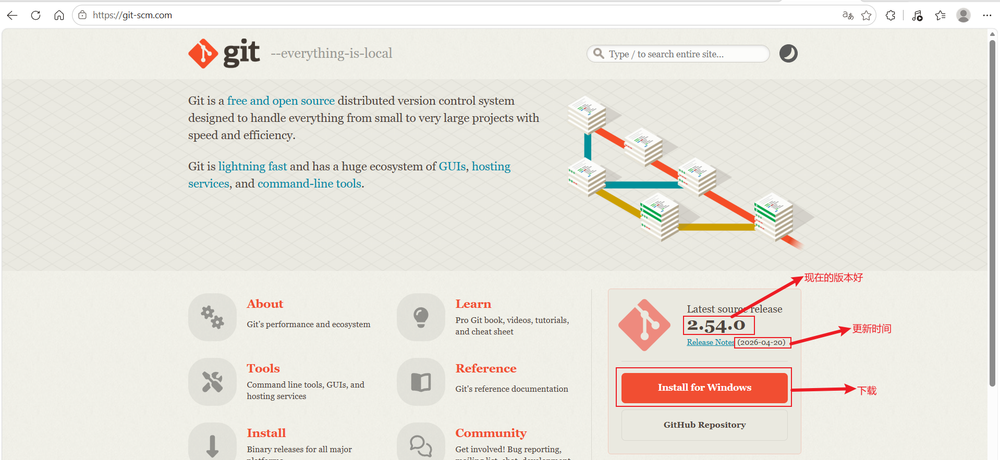
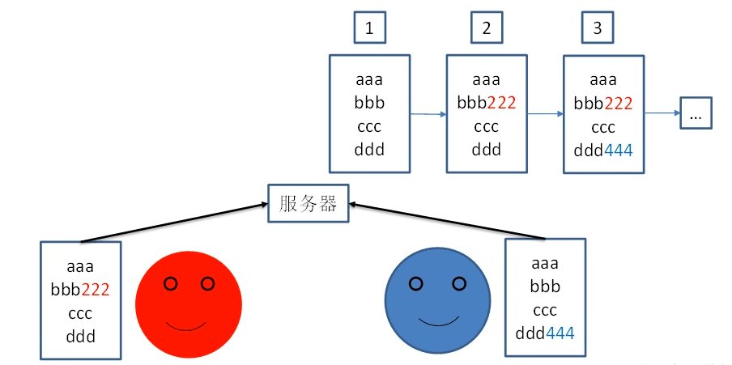
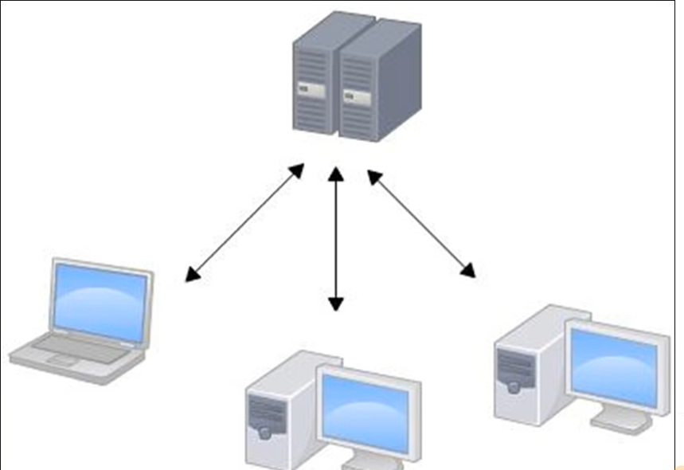
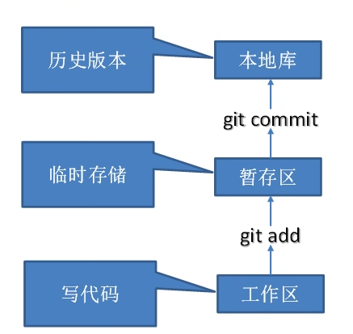
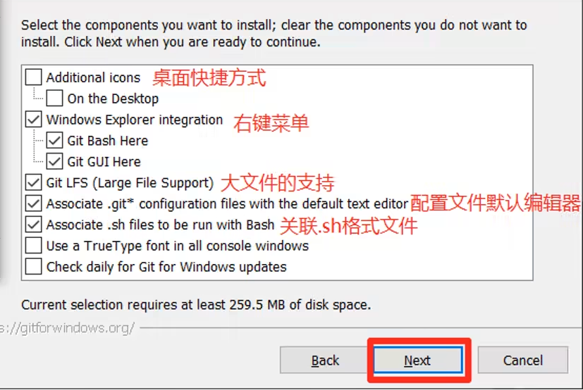
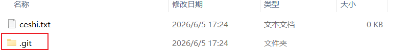
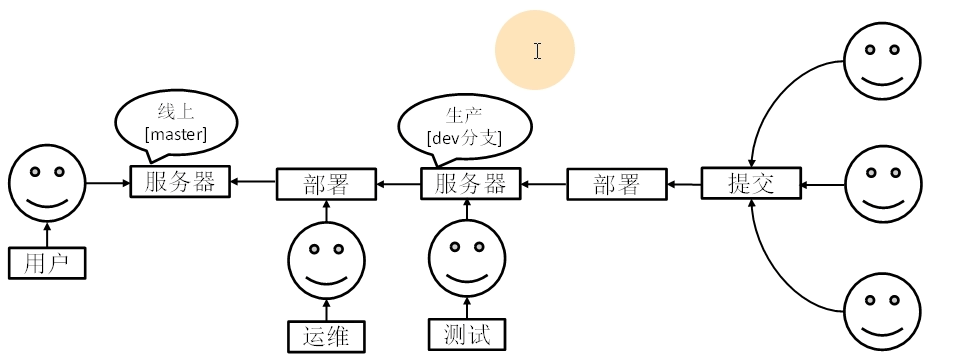
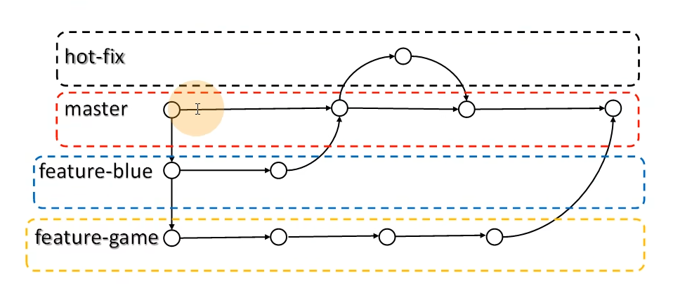

# Git

---

## 1.Git概述

Git 是一个免费的、开源的**分布式版本控制系统**，可以快速高效地处理从小型到大型的各种项目。

Git 占地面积小，性能极快。 它具有廉价的本地库，方便的暂存区域和多个工作流分支等特性。
其性能优于 Subversion、CVS、Perforce 和 ClearCase 等版本控制工具。

Git官网：https://git-scm.com



---


### 1.1 何为版本控制

版本控制是一种记录文件**内容变化**，以便将来查阅特定版本修订情况的系统。

版本控制其实最重要的是可以记录文件修改历史记录，从而让用户能够查看**历史版本**，方便**版本切换**。

像我们平常的版本就是 1.0，1.1，1.2


---

### 1.2 为什么需要版本控制

主要是用于团队之间的合作，防止你提交的代码覆盖别人的代码。

效果如下图：这样A,B的修改都会生效。




---

### 1.3版本控制工具

#### 集中式版本控制工具

CVS、**SVN**(Subversion)、VSS……

集中化的版本控制系统诸如 CVS、SVN 等，都有一个**单一**的**集中管理**的服务器，保存所有文件的修订版本，而协同工作的人们都通过客户端连到这台服务器，取出最新的文件或者提交更新。多年以来，这已成为版本控制系统的标准做法。

这种做法带来了许多好处，每个人都可以在一定程度上看到项目中的其他人正在做些什么。而管理员也可以轻松掌控每个开发者的权限，并且管理一个集中化的版本控制系统，要远比在各个客户端上维护本地数据库来得轻松容易。

**但是**，这么做显而易见的缺点是中央服务器的单点故障。如果服务器宕机一小时，那么在这一小时内，谁都无法提交更新，也就无法协同工作。也就是说如果服务器死掉了，那么基本上项目停了。

如下图：



工作流程就是A先写好，然后提交上去，然后B从上面下载下来，然后写了在推上去。

#### 分布式版本控制工具

**Git**、Mercurial、Bazaar、Darcs……

像 Git 这种分布式版本控制工具，客户端提取的不是最新版本的文件快照，而是把代码仓库完整地镜像下来（本地库）。这样任何一处协同工作用的文件发生故障，事后都可以用其他客户端的本地仓库进行恢复。因为每个客户端的每一次文件提取操作，实际上都是一次对整个文件仓库的完整备份。

分布式的版本控制系统出现之后,解决了集中式版本控制系统的缺陷:

1. 服务器断网的情况下也可以进行开发（因为版本控制是在本地进行的）
2. 每个客户端保存的也都是整个完整的项目（包含历史记录，更加安全）


---

### 1.4Git工作机制



主要分为了三个区：

工作区：也就是我们写代码，进行修改的时候所在的区域

暂存区：在工作区执行 `git add` 命令把内容添加到暂存区，注意此时并没有进去本地库，所以还是没有版本信息

本地库：执行 `git commit` 把暂存区的内容提交到本地库，这个时候就会生成版本了


---

### 1.5Git和代码托管中心

代码托管中心是基于网络服务器的远程代码仓库，一般我们简单称为**远程库**。

**局域网**

- ✓ GitLab

**互联网**

- ✓ GitHub（外网）
- ✓ Gitee 码云（国内网站）


---

## 2.Git的安装

git的安装很简单，只需要记住不要放在有中文的路径下就可以了。



到这里选项可以自己根据自己需要的来选择，但是一般默认就可以了。

安装这部分详细的笔记可以去看https://blog.csdn.net/mukes/article/details/115693833


---

## 3.Git常用命令

Git主要命令

| 命令名称                               | 作用                   |
| :------------------------------------- | ---------------------- |
| `git config --global user.name` 用户名 | 设置用户签名(必须设置) |
| `git config --global user.email` 邮箱  | 设置用户签名(必须设置) |
| `git init`                             | 初始化本地库           |
| `git status`                           | 查看本地库状态         |
| `git add` 文件名                       | 添加到暂存区           |
| `git commit -m "日志信息"` 文件名      | 提交到本地库           |
| `git reflog`                           | 查看历史记录           |
| `git reset --hard` 版本号              | 版本穿梭               |

---

### 3.1 设置用户签名

1）基本语法

```bash
git config --global user.name 用户名
git config --global user.email 邮箱
```

2）案例

全局范围的签名设置

```bash
git config --global user.name guili
git config --global user.email xxxx@qq.com
$ cat ~/.gitconfig  #查看配置
[user]
  name = guili
  email = xxxx@qq.com
```

**说明：**

签名的作用是区分不同操作者身份。用户的签名信息在每一个版本的提交信息中能够看到，以此确认本次提交是谁做的。**Git 首次安装必须设置一下用户签名，否则无法提交代码。**

**注意：** 这里设置用户签名和将来登录 GitHub（或其他代码托管中心）的账号没有任何关系。

---

### 3.2 初始化本地库

1）基本语法

```bash
git init
```

2）案例

```bash
txy@TXY MINGW64 /f/Game/git-demo
$ git init     #初始化仓库
Initialized empty Git repository in F:/Game/git-demo/.git/

txy@TXY MINGW64 /f/Game/git-demo (master)
$ ll -a
total 0
drwxr-xr-x 1 txy 197121 0 Jun  5 17:24 ./
drwxr-xr-x 1 txy 197121 0 Jun  5 17:23 ../
drwxr-xr-x 1 txy 197121 0 Jun  5 17:24 .git/     #这就是我们的Git仓库了
-rw-r--r-- 1 txy 197121 0 Jun  5 17:24 ceshi.txt
```

3）结果查看



初始化后，我们可以看到这么以及文件夹，就是我们的Git仓库


---

### 3.3 查看本地库状态

#### 3.3.1 首次查看（工作区没有任何文件）

```bash
git status
```

操作：在初始化后的 Git 仓库（无新增/修改文件）中，执行 git status 命令。
终端会提示类似 “On branch master… Nothing to commit, working tree clean”（或对应分支的状态），说明工作区和暂存区均无待处理的内容。
意义：验证仓库初始化的完整性，确认当前环境“干净”，无历史残留或未跟踪的文件。

#### 3.3.2 新增文件

操作：在工作区创建新文件（如 echo "Hello Git" > hello.txt），再次执行 git status。
预期输出：终端会显示 “Untracked files: hello.txt”（未跟踪文件），并提示可通过 git add <file> 将文件纳入版本控制。
意义：理解 Git 对“新增但未提交”文件的识别逻辑——新文件默认处于“未跟踪（Untracked）”状态，需手动添加到暂存区后才会被 Git 管理。

#### 3.3.3 再次查看

操作：保持 hello.txt 未被 git add 的状态，重复执行 git status。
预期输出：仍会显示 hello.txt 为“Untracked files”，且不会自动将其纳入版本控制。
意义：强化认知：Git 仅跟踪已明确添加（git add）或已提交（git commit）的文件；未跟踪的文件需主动操作才会进入版本管理流程。

---


### 3.4 添加暂存区

#### 1）基本语法

```bash
git add [文件名]    # 添加指定文件到暂存区
git add .          # 添加当前目录下所有修改/新增的文件到暂存区
```

#### 2）案例

**3.4.1 将工作区的文件添加到暂存区**
假设工作区有一个新建的文件 `hello.txt`。

```bash
$ git add hello.txt
# 或者添加所有文件
$ git add .
```

**3.4.2 查看状态（检测到暂存区有新文件）**
执行添加命令后，使用 status 命令验证。

```bash
$ git status
On branch master
Changes to be committed:
  (use "git restore --staged <file>..." to unstage)
        new file:   hello.txt
```

**说明：**
此时输出中显示 `Changes to be committed`（待提交的变更），且文件颜色通常为绿色（视终端配置而定），说明文件已经成功从**工作区**进入到了**暂存区**。

------

### 3.5 提交本地库

#### 1）基本语法

```bash
git commit -m "提交的日志信息" [文件名] 
# 如果不加文件名，默认提交暂存区的所有内容
```

#### 2）案例

**3.5.1 将暂存区的文件提交到本地库**
将刚才暂存区的 `hello.txt` 正式提交到版本库。

```bash
$ git commit -m "第一次提交hello.txt"
[master (root-commit) e47546a] 第一次提交hello.txt
 1 file changed, 1 insertion(+)
 create mode 100644 hello.txt
```

**3.5.2 查看状态（没有文件需要提交）**
提交完成后，再次检查状态。

```bash
$ git status
On branch master
nothing to commit, working tree clean
```

**说明：**

- **提交的作用**：将暂存区的内容永久保存到本地 Git 仓库（`.git` 目录）中，生成一个版本记录。
- **状态解读**：当看到 `nothing to commit, working tree clean` 时，意味着工作区和暂存区都是干净的，当前的代码状态已经完全被 Git 记录，可以进行下一次修改循环了。

------


### 3.6 修改文件 

#### 1）基本语法

```bash
# 编辑文件内容（使用 vim、nano 或编辑器直接修改）
vim hello.txt 

# 查看状态
git status

# 添加到暂存区
git add hello.txt

# 提交到本地库
git commit -m "修改了hello.txt的内容" hello.txt
```

#### 2）案例

**3.6.1 查看状态（检测到工作区有文件被修改）**
假设我们已经修改了 `hello.txt` 的内容，但还没有执行 `git add`。

```bash
$ git status
On branch master
Changes not staged for commit:
  (use "git add <file>..." to update what will be committed)
  (use "git restore <file>..." to discard changes in working directory)
        modified:   hello.txt
```

**说明：**
此时输出显示 `Changes not staged for commit`（变更尚未暂存），且文件名通常为红色。这表示 Git 检测到了**工作区**的文件发生了变化，但这些变化还没有被放入**暂存区**。

**3.6.2 将修改的文件再次添加暂存区**
为了让 Git 记录这次修改，我们需要再次执行添加命令。

```bash
$ git add hello.txt
```

**3.6.3 查看状态（工作区的修改添加到了暂存区）**
添加完成后，再次检查状态。

```bash
$ git status
On branch master
Changes to be committed:
  (use "git restore --staged <file>..." to unstage)
        modified:   hello.txt
```

**说明：**
此时输出变回 `Changes to be committed`（待提交的变更），文件名变为绿色。这说明工作区的修改已经成功同步到了**暂存区**，准备进行下一次提交。

------

### 3.7 历史版本

#### 1）基本语法

```bash
# 查看历史版本日志
git log 
git log --oneline  # 简洁模式

# 版本穿梭（回退/前进）
git reset --hard [版本号/HEAD^]
```

#### 2）案例

**3.7.1 查看历史版本**
当我们进行了多次提交后，可以通过 log 命令查看历史记录。

```bash
$ git log
commit e47546a... (HEAD -> master)
Author: guili <xxxx@qq.com>
Date:   ...
    修改了hello.txt的内容

commit a1b2c3d...
Author: guili <xxxx@qq.com>
Date:   ...
    第一次提交hello.txt
```

**说明：**
`git log` 会按时间倒序列出所有的提交记录，包含完整的 Commit ID（哈希值）、作者、日期和提交信息。这是追溯项目演变过程的主要手段。

**3.7.2 版本穿梭**
如果我们想回到“第一次提交”时的状态（假设其 ID 为 `a1b2c3d`）。

```bash
$ git reset --hard a1b2c3d
HEAD is now at a1b2c3d 第一次提交hello.txt
```

**说明：**

- **作用**：`git reset --hard` 是 Git 中非常强大的命令，它会将 HEAD 指针移动到指定的版本，并同时重置**暂存区**和**工作区**的内容与该版本完全一致。
- **注意**：这是一个“破坏性”操作，当前版本之后的所有修改如果没有备份，将会丢失。也可以使用 `HEAD^` 表示回退到上一个版本，`HEAD~100` 表示回退到前 100 个版本。

------


## 4.Git分支



---

### 4.1 什么是分支

在版本控制过程中，同时推进多个任务，为每个任务，我们就可以创建每个任务的单独分支。使用分支意味着程序员可以把自己的工作从开发主线上分离开来，开发自己分支的时候，不会影响主线分支的运行。对于初学者而言，分支可以简单理解为副本，一个分支就是一个单独的副本。（分支底层其实也是指针的引用）

---



---

### 4.2 分支的好处

同时并行推进多个功能开发，提高开发效率。

各个分支在开发过程中，如果某一个分支开发失败，不会对其他分支有任何影响。失败的分支删除重新开始即可。

---

### 4.3 分支的操作

1）基本语法

```bash
git branch              # 查看分支
git branch 分支名        # 创建分支
git branch -m 旧名 新名   # 修改（重命名）分支
git checkout 分支名      # 切换分支
git merge 分支名         # 合并分支
```

2）案例

#### 4.3.1 查看分支

查看当前仓库中有哪些分支，以及当前处于哪个分支。

```bash
$ git branch
* master
```

**说明：** `*` 号表示当前所在的分支。

#### 4.3.2 创建分支

基于当前分支创建一个名为 `hot-fix` 的新分支。

```bash
$ git branch hot-fix
$ git branch
  hot-fix
* master
```

#### 4.3.3 修改分支

将 `hot-fix` 分支重命名为 `fix-bug`。

```bash
$ git branch -m hot-fix fix-bug
$ git branch
  fix-bug
* master
```

#### 4.3.4 切换分支

从 `master` 分支切换到 `fix-bug` 分支进行开发。

```bash
$ git checkout fix-bug
Switched to branch 'fix-bug'
$ git branch
* fix-bug
  master
```

**说明：** 切换分支后，工作区的文件内容会更新为该分支最新提交的状态。

#### 4.3.5 合并分支

在 `fix-bug` 分支完成开发并提交后，切回 `master` 分支，将 `fix-bug` 的内容合并进来。

```bash
$ git checkout master
$ git merge fix-bug
Updating e47546a..d028123
Fast-forward
 hello.txt | 1 +
 1 file changed, 1 insertion(+)
```

#### 4.3.6 产生冲突

当两个分支同时修改了同一个文件的同一行内容时，合并会产生冲突。

```bash
$ git merge fix-bug
Auto-merging hello.txt
CONFLICT (content): Merge conflict in hello.txt
Automatic merge failed; fix conflicts and then commit the result.
```

#### 4.3.7 解决冲突

手动编辑冲突文件，保留需要的代码，删除冲突标记（`<<<<<<<`, `=======`, `>>>>>>>`），然后重新提交。

```bash
# 1. 编辑文件，解决冲突内容
vim hello.txt 

# 2. 添加解决后的文件
git add hello.txt

# 3. 提交合并结果
git commit -m "解决了合并冲突"
```

**说明：**
分支操作是 Git 的核心功能。**查看、创建、切换**是日常高频操作；**合并**是将开发成果集成的关键步骤；而**冲突解决**则是多人协作或并行开发时必须掌握的技能，Git 无法自动判断保留哪部分代码时，必须由人工介入决定。

------


## 5. Git 团队协作机制

### 1）核心概念与流程

在团队协作中，通常采用 **Forking Workflow（分支开发工作流）** 或 **Git Flow** 模式。最基础的协作模型包含三个角色：**中心仓库 (Remote)**、**开发者本地仓库 (Local)** 和 **暂存区/工作区**。

基本流程如下：

1. **克隆 (Clone)**：从远程服务器下载代码到本地。
2. **拉取 (Pull)**：在开发前，先同步远程的最新代码，防止冲突。
3. **开发 (Develop)**：在本地创建分支进行功能开发、提交 (Commit)。
4. **推送 (Push)**：将本地完成的代码上传到远程仓库。

### 2）案例演示

假设团队中有两名开发者：`User A` 和 `User B`，共同维护一个名为 `project` 的仓库。

**场景一：User A 初始化项目并推送**

```bash
# 1. 在本地创建项目并提交
$ git init project
$ cd project
$ echo "Initial Commit" > readme.txt
$ git add .
$ git commit -m "first commit"

# 2. 关联远程仓库并推送
$ git remote add origin https://github.com/team/project.git
$ git push -u origin master
```

**场景二：User B 加入开发（克隆与拉取）**

```bash
# 1. User B 克隆远程仓库到本地
$ git clone https://github.com/team/project.git
$ cd project

# 2. User B 开始工作前，习惯性地拉取最新代码（虽然刚克隆不需要，但这是好习惯）
$ git pull origin master
```

**场景三：User A 和 User B 并行开发（模拟冲突与解决）**

- **User A** 修改了 `readme.txt` 的第一行，并推送到远程。
- **User B** 也修改了 `readme.txt` 的第一行，准备推送。

```bash
# User B 尝试推送
$ git push origin master
# 报错！提示 rejected，因为远程有 User A 的新提交，而 User B 本地没有。

# User B 必须先拉取 (Pull)
$ git pull origin master
# 此时 Git 会提示 Automatic merge failed; fix conflicts and then commit the result.
# 说明产生了冲突 (Conflict)
```

**解决冲突步骤：**

1. 打开冲突文件（如 `readme.txt`），找到冲突标记 `<<<<<<<`, `=======`, `>>>>>>>`。
2. 手动编辑文件，决定保留谁的代码，或者融合两者的代码。
3. 重新提交并推送。

```bash
# User B 解决完文件内容后
$ git add readme.txt
$ git commit -m "resolve conflict with User A"
$ git push origin master
```

### 3）常用协作命令汇总

| 操作             | 命令                       | 说明                                 |
| ---------------- | -------------------------- | ------------------------------------ |
| **查看远程地址** | `git remote -v`            | 查看当前关联的远程仓库 URL           |
| **抓取远程更新** | `git fetch origin`         | 下载远程最新数据，但不自动合并       |
| **拉取并合并**   | `git pull origin <branch>` | 相当于 `fetch` + `merge`，开发前必做 |
| **推送代码**     | `git push origin <branch>` | 将本地提交上传到远程指定分支         |

### 4）说明

- **为什么要 Pull？** 多人协作时，代码是动态变化的。如果不先拉取别人的代码直接推送，Git 为了保证版本历史不乱，会拒绝你的推送（Non-fast-forward）。
- **冲突是好事吗？** 冲突意味着两个人在同一时间修改了同一块逻辑。虽然处理起来麻烦，但它强制团队成员进行沟通，避免代码被错误覆盖。
- **最佳实践**：尽量做到 **“小步提交，频繁推送”**。不要憋大招，每天多次 pull 和 push，可以大大降低解决冲突的难度。
