# maven

本笔记旨在系统梳理 Maven 的核心概念与实操技巧。内容涵盖 Maven 的核心理念（约定优于配置）、POM 文件详解、依赖管理机制以及生命周期运作原理，为后续的 Java Web 及微服务开发打下坚实的工程化基础。

---

## 1.maven简介

### 1.1 应用场景

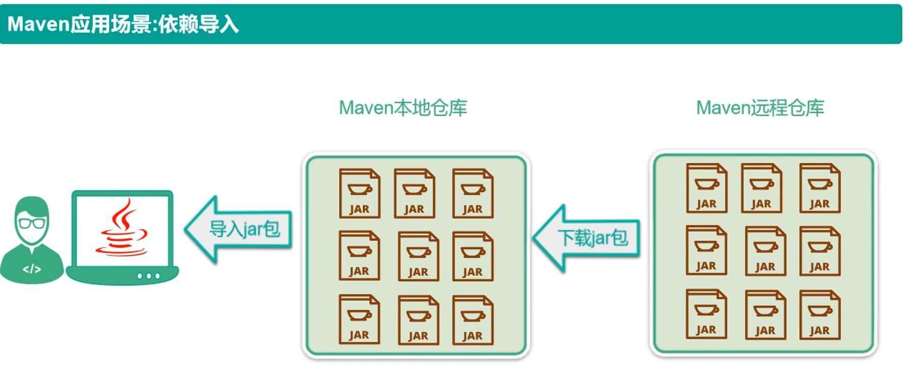

---

Maven 就像一个智能的“图书管理员”，它通过两级仓库机制来管理项目所需的 jar 包（依赖），彻底解决了手动复制粘贴 jar 包的痛点。

**流程解析：**

1. Maven 远程仓库 (Remote Repository)：
   - 这是互联网上的公共仓库（如 Maven Central），存储了海量的开源 jar 包。
   - **动作**：当本地没有需要的资源时，Maven 会从这里**下载**。
2. Maven 本地仓库 (Local Repository)：
   - 这是你电脑硬盘上的一个文件夹（默认在 `~/.m2/repository`）。
   - **作用**：作为缓存区。一旦从远程下载过，就会保存在这里。下次其他项目需要同样的包，直接从本地获取，无需重复下载，节省时间和流量。
3. 开发者/项目 (Project)：
   - **动作**：项目配置好坐标后，Maven 自动将 jar 包从本地仓库**导入**到项目的 Classpath 中供代码使用。

**总结**

- **自动化**：不再需要手动去官网下载 jar 包并复制到 `lib` 目录。
- **版本控制**：通过配置文件精确指定版本号，避免版本冲突。
- **复用性**：一次下载，多项目共享（只要坐标相同，所有项目共用本地仓库里的那一份）。

------

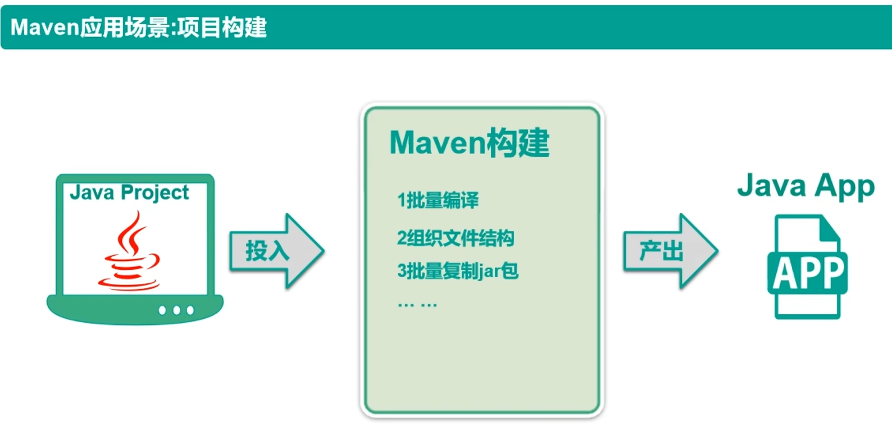

---

在没有 Maven 之前，将代码变成可运行的程序（如 jar 包或 war 包）需要人工一步步操作。Maven 将这些步骤标准化、自动化，形成了一个“黑盒”处理流程。

**流程解析：**

1. 投入 (Input)：
   - **Java Project**：即我们编写的源代码（`.java` 文件）、资源文件（配置文件、图片等）。
2. Maven 构建过程 (Processing)：
   - Maven 充当了“自动化流水线”的角色，它在后台默默完成了以下关键工作：
     - **批量编译**：自动调用编译器（javac），将所有 `.java` 文件编译成 `.class` 字节码文件。
     - **组织文件结构**：按照标准目录结构整理编译后的文件、资源文件和依赖包。
     - **批量复制 jar 包**：自动将项目依赖的第三方库复制到输出目录中，确保程序运行时能找到它们。
     - *（注：图中省略号还包含了测试、打包等步骤）*
3. 产出 (Output)：
   - **Java App**：最终生成的可交付产物，通常是一个可以直接运行的 `.jar` 包，或者部署到服务器上的 `.war` 包。

**总结**

- **一键构建**：无论项目多大，只需一条命令（如 `mvn package`），即可完成从源码到成品的全过程。
- **标准化**：强制统一了项目的目录结构和构建流程，让团队成员之间的协作更加顺畅（不用问“你的编译输出在哪？”）。
- **解放双手**：开发者只需专注于写代码，剩下的编译、打包、依赖整合全交给 Maven。

------

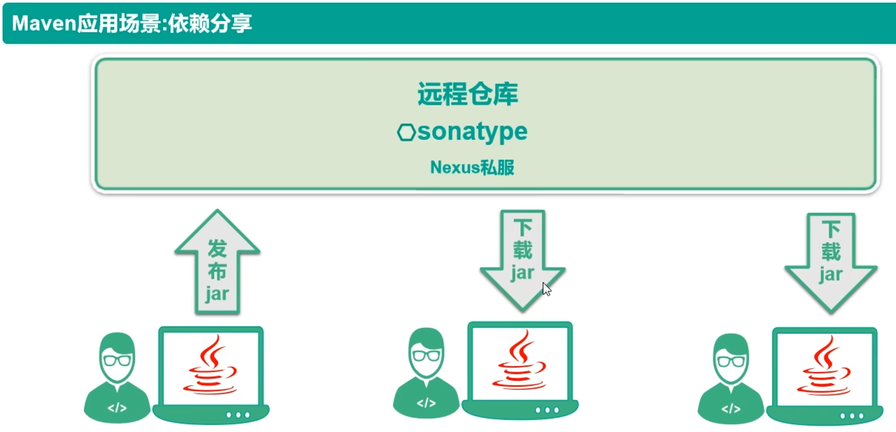

---

在大型项目或团队开发中，不同模块、不同项目之间往往需要共享公共代码（如工具类、基础框架）。Maven 通过“远程仓库”实现了这种高效、标准化的依赖分享。

**流程解析：**

1. 发布 jar (Upload)：
   - 左侧开发者将本项目编译打包好的 `jar` 文件，通过 Maven 命令（如 `mvn deploy`）**上传**到公司内部的**远程仓库**（如 Nexus私服）。
   - 这个动作相当于把“公共组件”发布到团队的“共享资源池”。
2. 远程仓库 (Remote Repository)：
   - 图中顶部的“远程仓库”通常指企业内部搭建的 **Nexus 私服**（或 Sonatype Nexus），它扮演着“内部中央仓库”的角色。
   - 它存储了所有团队共享的 `jar` 包，包括第三方开源库和公司内部自研组件。
3. 下载 jar (Download)：
   - 中间和右侧的开发者，在他们的 `pom.xml` 中声明了对该 `jar` 包的依赖坐标后，Maven 会自动从**远程仓库\**\**下载**所需的 `jar` 包到本地仓库，供项目使用。
   - 这确保了所有团队成员使用的都是同一版本、经过验证的公共组件。

**总结**

- **组件复用**：避免重复造轮子，一个团队开发的工具类可以被多个项目直接引用。
- **版本统一**：通过仓库集中管理，确保所有项目使用的是同一个版本的依赖，减少因版本不一致导致的 bug。
- **安全可控**：企业内部私服可以控制哪些包可以被使用，避免引入有安全风险或不合规的开源组件。
- **效率提升**：新成员加入项目时，只需拉取代码并执行 `mvn install`，所有依赖自动下载，环境搭建时间从小时级缩短到分钟级。

---

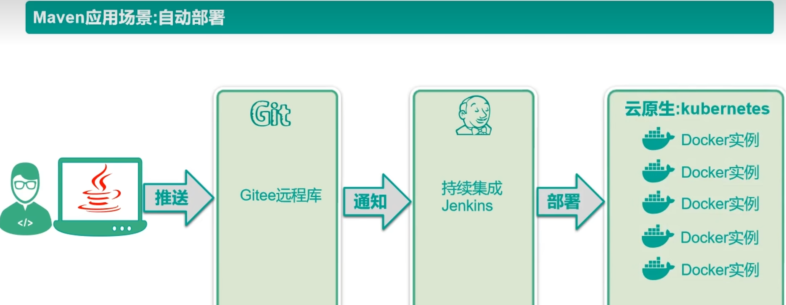

---

在现代化的云原生开发中，代码写完并不是结束，而是开始。Maven 通过与 Git、Jenkins 和 Kubernetes 等工具的配合，实现了从“代码提交”到“服务上线”的全链路自动化。

**流程解析：**

1. 代码推送 (Push)：
   - 开发者在本地完成代码编写后，通过 `git push` 将代码推送到远程代码仓库（如图中所示的 **Gitee**，也可以是 GitHub/GitLab）。
2. 持续集成触发 (Trigger)：
   - 远程仓库检测到代码更新，通过 Webhook **通知**持续集成服务器（**Jenkins**）。
   - Jenkins 作为“大管家”，立即启动构建任务。
3. Maven 构建与打包 (Build)：
   - *（图中隐含步骤）* Jenkins 调用 Maven 命令（如 `mvn clean package docker:build`），自动完成编译、测试、打包，甚至直接构建 Docker 镜像。
4. 自动部署 (Deploy)：
   - Jenkins 将构建好的产物（通常是 Docker 镜像）**部署**到生产环境或测试环境。
   - 图中右侧展示了**云原生 Kubernetes (K8s)** 环境，Maven 构建的应用被封装在多个 **Docker 实例**（容器）中运行，实现高可用和弹性伸缩。

**总结**

- **解放运维**：告别手动上传 jar 包、重启服务器的原始操作，实现“代码提交即上线”。
- **标准化交付**：Maven 确保了每次构建的环境和依赖都是一致的，消除了“在我电脑上能跑，服务器上就不行”的问题。
- **快速反馈**：一旦代码有问题，自动化流程会立即报错，让开发者能第一时间修复。
- **云原生基石**：Maven 是连接传统 Java 代码与 Docker/K8s 云原生架构的桥梁，是现代微服务架构不可或缺的一环。

---


### 1.2 依赖管理工具

Maven是一个依赖管理工具

1) jar 包的规模

随着我们使用越来越多的框架，或者框架封装程度越来越高，项目中使用的jar包也越来越多。项目中，一个模块里面用到上百个jar包是非常正常的。

比如下面的例子，我们只用到 SpringBoot、SpringCloud 框架中的三个功能：

- Nacos 服务注册发现
- Web 框架环境
- 视图模板技术 Thymeleaf

最终却导入了 106 个 jar 包：

```java
org.springframework.security:spring-security-rsa:jar:1.0.9.RELEASE:compile
com.netflix.ribbon:ribbon:jar:2.3.0:compile
org.springframework.boot:spring-boot-starter-thymeleaf:jar:2.3.6.RELEASE:compile
commons-configuration:commons-configuration:jar:1.8:compile
org.apache.logging.log4j:log4j-api:jar:2.13.3:compile
org.springframework:spring-beans:jar:5.2.11.RELEASE:compile
org.springframework.cloud:spring-cloud-starter-netflix-ribbon:jar:2.2.6.RELEASE:compile
    .......
```

------

使用maven的话，内容如下，简单干净：

```xml
<!-- Nacos 服务注册发现启动器 -->
<dependency>
    <groupId>com.alibaba.cloud</groupId>
    <artifactId>spring-cloud-starter-alibaba-nacos-discovery</artifactId>
</dependency>

<!-- web启动器依赖 -->
<dependency>
    <groupId>org.springframework.boot</groupId>
    <artifactId>spring-boot-starter-web</artifactId>
</dependency>

<!-- 视图模板技术 thymeleaf -->
<dependency>
    <groupId>org.springframework.boot</groupId>
    <artifactId>spring-boot-starter-thymeleaf</artifactId>
</dependency>
```

------

2) jar包的来源问题

- 这个jar包所属技术的官网。官网通常是英文界面，网站的结构又不尽相同，甚至找到下载链接还发现需要通过特殊的工具下载。
- 第三方网站提供下载。问题是不规范，在使用过程中会出现各种问题。
  - jar包的名称
  - jar包的版本
  - jar包内的具体细节
- 而使用 Maven 后，依赖对应的 jar 包能够自动下载，方便、快捷又规范。

3) jar包的导入问题 在web工程中，jar包必须存放在指定位置：

```text
test_web
├── src
└── web
    └── WEB-INF
        └── lib
            ├── apiguardian-api-1.1.2.jar
            └── druid-1.1.21.jar
```

------

在使用Maven之后，通过配置依赖(jar包)的坐标，查找本地仓库中相应jar包，若本地仓库没有，则统一从镜像网站或中央仓库中下载：

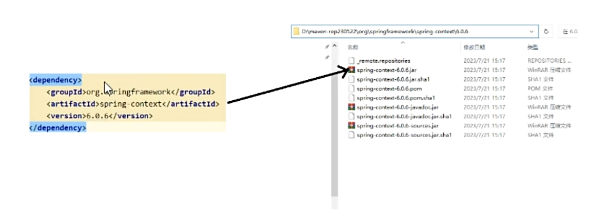

4) jar包之间的依赖

框架中使用的 jar 包，不仅数量庞大，而且彼此之间存在错综复杂的依赖关系。依赖关系的复杂程度，已经上升到了完全不能靠人力手动解决的程度。另外，jar 包之间有可能产生冲突。进一步增加了我们在 jar 包使用过程中的难度。

而实际上 jar 包之间的依赖关系是普遍存在的，如果要由程序员手动梳理无疑会增加极高的学习成本，而这些工作又对实现业务功能毫无帮助。

而使用 Maven 则几乎不需要管理这些关系，极个别的地方调整一下即可，极大的减轻了我们的工作量。

---


### 1.3 构建工具

1) 你没有注意过的构建

你可以不使用 Maven，但是构建必须要做。当我们使用 IDEA 进行开发时，构建是 IDEA 替我们做的

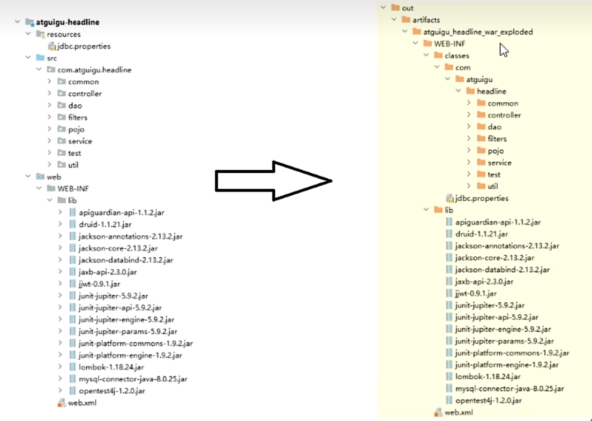

---

2) 脱离 IDE 环境仍需构建

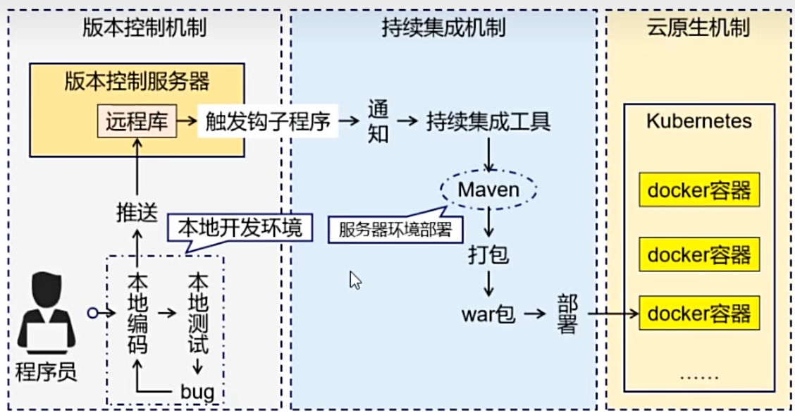

---

### 1.4 结论

- 管理规模庞大的 jar 包，需要专门工具。
- 脱离 IDE 环境执行构建操作，需要专门工具。

------


## 2. Maven介绍

https://maven.apache.org/what-is-maven.html

Maven 是一款为 Java 项目管理构建、依赖管理的工具（软件），使用 Maven 可以自动化构建、测试、打包和发布项目，大大提高了开发效率和质量。

Maven就是一个软件，掌握安装、配置、以及基本功能（项目构建、依赖管理）的理解和使用即可！

### 2.1. 依赖管理：

Maven 可以管理项目的依赖，包括自动下载所需依赖库、自动下载依赖需要的依赖并且保证版本没有冲突、依赖版本管理等。通过 Maven，我们可以方便地维护项目所依赖的外部库，避免版本冲突和转换错误等，而我们仅仅需要编写配置即可。

### 2.2. 构建管理：

项目构建是指将源代码、配置文件、资源文件等转化为能够运行或部署的应用程序或库的过程

Maven 可以管理项目的编译、测试、打包、部署等构建过程。通过实现标准的构建生命周期，Maven 可以确保每一个构建过程都遵循同样的规则和最佳实践。同时，Maven 的插件机制也使得开发者可以对构建过程进行扩展和定制。主动触发构建，只需要简单的命令操作即可。

我们把 Maven 这两个最核心的概念——**依赖管理**和**构建管理**，用生活中的例子拆解一下。

------

1. 依赖管理：你的“超级采购员”

**场景：**
想象你要组装一台电脑（开发一个项目）。你需要 CPU、显卡、内存条（这些就是第三方库/Jar包）。

- **没有 Maven 时（手动挡）：**
  - 你得自己去英特尔官网下 CPU 驱动，去英伟达官网下显卡驱动。
  - **麻烦点1：** 如果显卡驱动需要特定的主板驱动才能运行（**传递性依赖**），你还得自己去查、自己去下，漏一个电脑就开不了机。
  - **麻烦点2：** 你下了个新驱动，结果跟旧系统不兼容（**版本冲突**），电脑蓝屏了，你得花半天时间排查是哪个文件不对。
- **有了 Maven 后（自动挡）：**
  - 你只需要给 Maven 一张清单（`pom.xml`），上面写着：“我要 i9 处理器”。
  - Maven 的做法：
    1. **自动下载：** 它会自动去仓库把 i9 处理器给你搬回来。
    2. **解决传递依赖：** 它发现 i9 处理器需要特定的主板 BIOS，于是它**自动**把那个 BIOS 也下载并配置好了，不用你操心。
    3. **版本仲裁：** 如果你既要 i9 又要 i7 的某些功能，Maven 会根据规则自动帮你选一个最合适的版本，避免打架。

> **一句话总结：** 你只管说“我要什么”，Maven 负责把东西买回来、装好，并确保它们能和谐共处。

------

2. 构建管理：标准化的“中央厨房”

**场景：**
你要做一道复杂的菜（将代码变成可运行的软件）。这道菜需要：洗菜 -> 切菜 -> 腌制 -> 炒菜 -> 摆盘。

- **没有 Maven 时（手工作坊）：**

  - 每个人做菜的习惯不一样。张三先放盐，李四先放糖。
  - **后果：** 换个厨师（换个环境/换个人部署），做出来的味道就不对了，甚至可能因为忘了“腌制”这一步（漏了编译或测试步骤），导致菜没法吃（程序报错）。

- **有了 Maven 后（标准化流水线）：**

  - Maven 定义了一套严格的

    生命周期

    （Lifecycle）：

    1. `clean`（清理灶台）
    2. `compile`（洗菜切菜 - 编译代码）
    3. `test`（试吃 - 运行单元测试）
    4. `package`（装盘打包 - 生成 Jar/War 包）
    5. `install/deploy`（上桌/送外卖 - 发布到服务器）

  - **好处：** 不管是谁来做，也不管是在家里的厨房（本地 IDEA）还是餐厅的后厨（Jenkins 服务器），只要按下“开始”按钮，所有步骤都会按顺序严格执行，绝不出错。

> **一句话总结：** Maven 把写代码到上线的过程变成了像工厂流水线一样标准，保证每次生产出来的产品质量一致。

------

### 2.3. Maven 的工作原理模型图

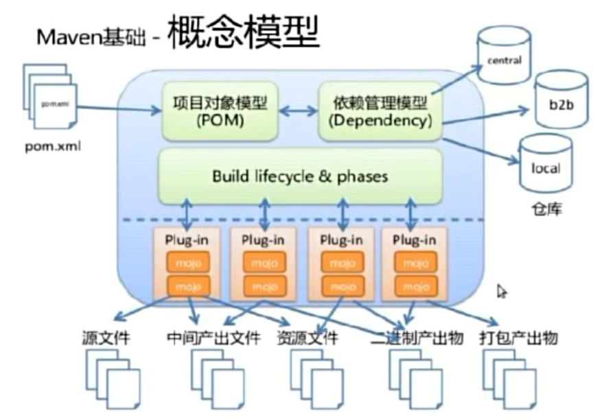

---

以从输入、核心模型、构建执行机制、依赖仓库以及最终产出几个维度来详细分析：

**1. 配置入口（左侧）：POM 文件**

- **pom.xml** 是整个 Maven 构建的起点。它定义了项目的所有配置信息，包括项目的基本信息、构建配置、以及最重要的依赖关系。所有的构建行为都围绕着这个文件展开。

**2. 核心模型（中部上方）：项目对象模型与依赖管理**

- **项目对象模型 (POM)**：负责描述项目本身的结构和构建配置。
- **依赖管理模型 (Dependency)**：负责管理项目所依赖的外部 JAR 包及其版本。
- 这两个模型之间是双向关联的，并且它们都依赖于**右侧的仓库**来获取实际的文件。

**3. 构建流程（中部下方）：生命周期与插件**

- **构建生命周期 & 阶段 (Build lifecycle & phases)**：Maven 定义了标准的构建生命周期（如 clean, default, site），并将其划分为多个阶段（如 compile, test, package 等）。
- **插件 (Plug-in) & 目标 (Mojo)**：生命周期中的具体工作是由**插件**来完成的。每个插件包含多个**Mojo**（Maven Old Java Object，即插件的具体执行目标）。图中间的虚线表示生命周期阶段会绑定并触发相应的插件目标来执行实际任务。

**4. 仓库机制（右侧）：依赖的存储与获取**

- **仓库**是存放依赖和构建产物的地方。图中列出了三种典型的仓库：
  - **local（本地仓库）**：位于开发者电脑上，缓存下载的依赖和本地构建的产物，优先读取。
  - **central（中央仓库）**：Maven 官方提供的公共仓库，是依赖的默认源头。
  - **b2b（远程/私服仓库）**：企业内部的私有仓库，用于存放私有依赖或代理中央仓库。

**5. 文件流转与产出（下方）：构建的具体对象**

- 插件在执行过程中会处理各种类型的文件，图下方展示了项目构建过程中的文件演变路径：
  - **源文件**（如 `.java` 代码）。
  - **中间产出文件**（如编译后的 `.class` 文件）。
  - **资源文件**（如 `.xml`, `.properties` 配置文件）。
  - **二进制产出物**。
  - **打包产出物**（最终的 JAR/WAR 包等）。

**总结：**
这张图勾勒出了 Maven **“约定优于配置”** 的内在逻辑：开发者只需在 **pom.xml** 中声明项目信息和依赖，Maven 就会依据**标准生命周期**，自动调用相应的**插件**去处理**源文件**，从各类**仓库**中下载所需的依赖，最终将项目编译并打包成**产出物**。

---


## 3.maven 安装和配置

### 3.1 Maven安装

<https://maven.apache.org/docs/history.html>

安装条件：maven需要本机安装java环境、必需包含java_home环境变量！

软件安装：右键解压即可（绿色免安装）

软件结构：

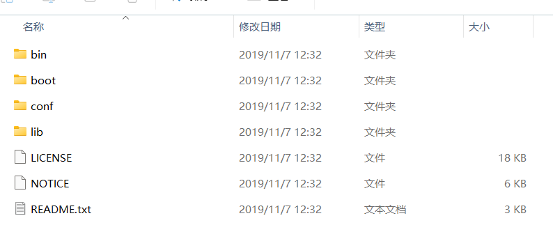

**bin**: 含有Maven的运行脚本

**boot**: 含有plexus-classworlds类加载器框架

**conf**: 含有Maven的核心配置文件

**lib**: 含有Maven运行时所需要的Java类库

LICENSE、NOTICE、README.txt: 针对Maven版本，第三方软件等简要介绍

---


### 3.2 Maven环境配置

配置MAVEN_HOME

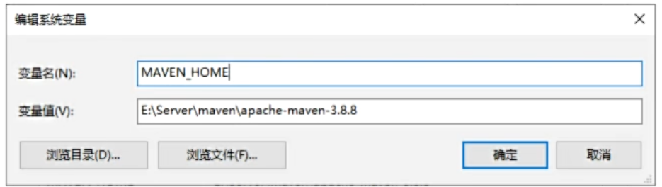

配置PATH

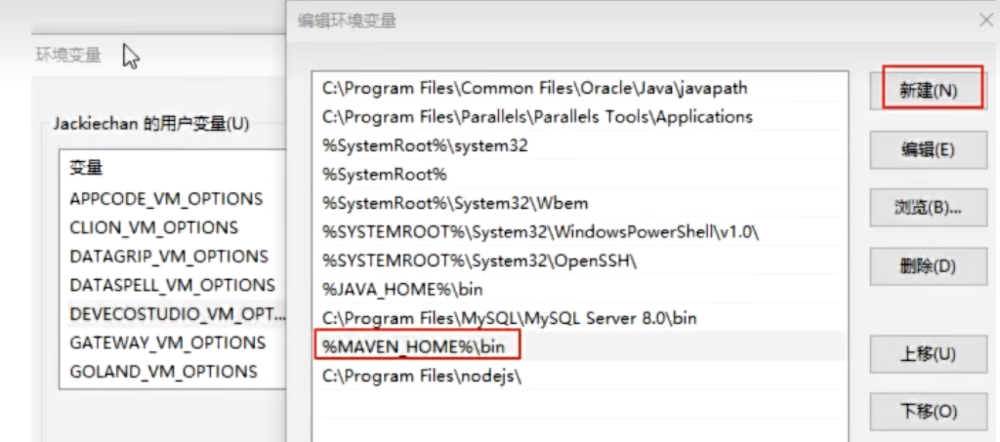

```bash
mvn -v #输出版本信息即可，如果错误，请仔细检查环境变量即可！
```


### 3.3 Maven的功能配置

我们需要需改 **maven/conf/settings.xml** 配置文件，来修改 maven 的一些默认配置。我们主要休要修改的有三个配置：

1. 依赖本地缓存位置（本地仓库位置）
2. maven下载镜像
3. maven选用编译项目的jdk版本

1. 配置本地仓库地址

```xml
<!-- localRepository
   | The path to the local repository maven will use to store artifacts.
   |
   | Default: ${user.home}/.m2/repository
  <localRepository>/path/to/local/repo</localRepository>
  -->

<!-- conf/settings.xml 55行 -->
<localRepository>D:\maven-repository</localRepository>
```

------

这段配置是把Maven默认的C盘仓库改到了D盘，能省不少系统盘空间。

2.配置镜像仓库

```xml
<mirror>
    <id>aliyunmaven</id>
    <mirrorOf>*</mirrorOf>
    <name>阿里云公共仓库</name>
    <url>https://maven.aliyun.com/repository/public</url>
</mirror>
```

**配置说明与注意事项**

- **`<mirrorOf>\*</mirrorOf>`**：这个星号表示匹配所有远程仓库。这意味着当你请求任何依赖时，Maven 都会优先去阿里云的服务器查找，而不是去国外的中央仓库，从而极大提升下载速度。(如果只拦截**中央仓库**请求，就把 * 改为central 阿里云没有的会走其他配置仓库)
- **放置位置**：请确保这段代码被包裹在 `<mirrors>` 和 `</mirrors>` 这一对标签之间。如果文件中已经存在其他 `<mirror>` 配置（比如默认的 central），建议将其注释掉或替换，以免冲突。
- **HTTPS 协议**：上述配置使用了 `https` 协议，这是目前推荐的安全标准。如果你在某些老旧的内网环境中遇到证书报错，可以尝试将 url 改为 `http://maven.aliyun.com/nexus/content/groups/public`（这是旧版地址，但在某些特定情况下依然有效）。

---


3. 配置jdk17版本项目构建

```xml
<!--在profiles节点(标签)下添加jdk编译版本 268行附近-->
<profile>
    <id>jdk-8</id>
    <activation>
        <activeByDefault>true</activeByDefault>
        <jdk>1.8</jdk> <!-- 注意：JDK 8 的版本号通常写作 1.8 -->
    </activation>
    <properties>
        <maven.compiler.source>1.8</maven.compiler.source>
        <maven.compiler.target>1.8</maven.compiler.target>
        <maven.compiler.compilerVersion>1.8</maven.compiler.compilerVersion>
    </properties>
</profile>
```

------


## 4.基于IDEA创建Maven工程

### 4.1 Maven 核心概念GAVP 坐标详解

（1）什么是 GAVP？

在 Maven 的世界中，为了区分和管理成千上万个项目，每个项目都必须有一个全球唯一的“身份证号”。这个身份证号由四个属性组成，统称为 **GAVP**。

- **作用**：就像人的“姓+名”一样，用于在仓库中唯一标识一个项目，方便其他项目引用（依赖）它。
- 组成：
  - **G**roupId（组ID）
  - **A**rtifactId（项目ID）
  - **V**ersion（版本）
  - **P**ackaging（打包方式，可选，默认为 jar）

> **通俗理解**：
> 如果把 Maven 仓库想象成一个巨大的图书馆，GAVP 就是书的**索书号**。没有它，管理员（Maven）就找不到你的书，别人也没法借阅（引用）你的代码。

------

（2） GAV 命名规范与规则

| 属性           | 官方定义/格式                               | 通俗解读 (人话版)                                            | 示例 (正例)                              |
| -------------- | ------------------------------------------- | ------------------------------------------------------------ | ---------------------------------------- |
| **GroupId**    | `com.{公司/BU}.业务线.[子业务线]` (最多4级) | **“出版社”或“家族姓氏”**。 通常用公司域名的反写，表示这个项目属于哪个组织或部门。 | `com.taobao.tddl` `com.alibaba.sourcing` |
| **ArtifactId** | `产品线名-模块名` (语义不重复)              | **“书名”或“具体产品名”**。 表示在这个组织下，具体的某个项目或模块叫什么。建议用中划线 `-` 连接。 | `tc-client` `bookstore`                  |
| **Version**    | `主版本号.次版本号.修订号`                  | **“第几版”**。 用来标记代码的更新程度，遵循“语义化版本”规则。 | `1.0.0` `2.1.3`                          |

------

（3） 版本号 (Version) 的详细含义

- **格式**：`X.Y.Z` (例如 1.2.3)

1. 主版本号 (X)：

   大改动

   - **含义**：做了不兼容的 API 修改，或者增加了改变产品方向的新功能。
   - **场景**：比如重构了底层架构，旧代码完全不能用了，必须升级。

2. 次版本号 (Y)：

   新功能

   - **含义**：做了向下兼容的功能性新增。
   - **场景**：比如增加了一个新接口、新类，但老的功能都能正常使用。

3. 修订号 (Z)：

   修 Bug

   - **含义**：修复 Bug，没有修改方法签名，保持 API 兼容性。
   - **场景**：比如修复了一个空指针异常，或者优化了一行代码逻辑。

------

（4）Packaging (打包方式)

虽然它是“可选项”，但在实际创建工程时非常重要。

- **默认值**：如果不写，默认是 `jar`。
- 常见类型：
  - packaging 属性为 jar（默认值），代表普通的Java工程，打包以后是.jar结尾的文件。
  - packaging 属性为 war，代表Java的web工程，打包以后.war结尾的文件。
  - packaging 属性为 pom，代表不会打包，用来做继承的父工程。

------

 **总结：如何创建一个规范的 Maven 项目？**

当你使用 IDEA 创建新项目时，按照以下思路填写即可：

1. **GroupId**：填你公司的域名反写（如 `com.mycompany`）。
2. **ArtifactId**：填你的项目名（如 `my-project`）。
3. **Version**：刚开始一般填 `1.0-SNAPSHOT`（SNAPSHOT 代表快照版，即正在开发中、不稳定的版本）。

------


### 4.2 Idea构建Maven Java SE工程

注意：此处省略了version，直接给了一个默认值：**1.0-SNAPSHOT**
自己后期可以在项目中随意修改！

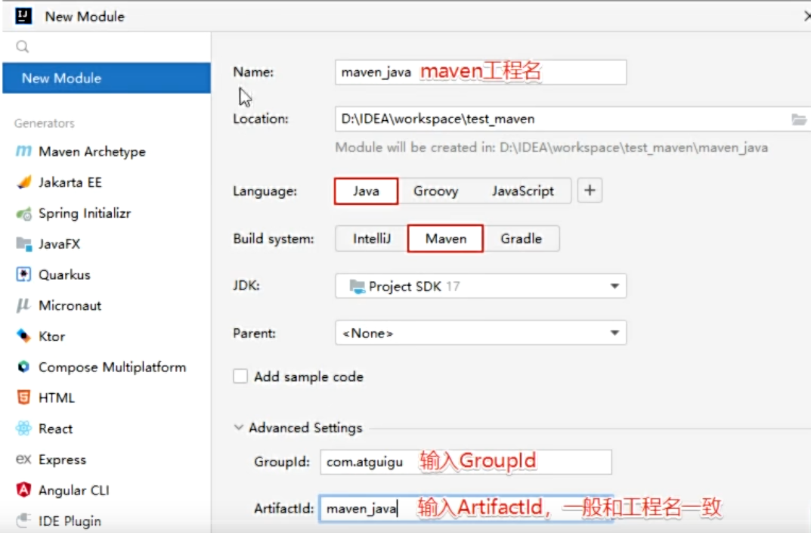

---


### 4.3 Maven工程项目结构说明

Maven 是一个强大的构建工具，它提供一种标准化的项目结构，可以帮助开发者更容易地管理项目的依赖、构建、测试和发布等任务。以下是 Maven Web 程序的文件结构及每个文件的作用：

```text
|-- pom.xml                       # Maven 项目管理文件
|-- src
    |-- main                      # 项目主要代码
    |   |-- java                  # Java 源代码目录
    |   |   `-- com/example/myapp # 开发者代码主目录
    |   |       |-- controller    # 存放 Controller 层代码的目录
    |   |       |-- service       # 存放 Service 层代码的目录
    |   |       |-- dao           # 存放 DAO 层代码的目录
    |   |       `-- model         # 存放数据模型的目录
    |   |-- resources             # 资源目录，存放配置文件、静态资源等
    |   |   |-- log4j.properties  # 日志配置文件
    |   |   |-- spring-mybatis.xml# Spring Mybatis 配置文件
    |   |   `-- static            # 存放静态资源的目录
    |   |       |-- css           # 存放 CSS 文件的目录
    |   |       |-- js            # 存放 JavaScript 文件的目录
    |   |       `-- images        # 存放图片资源的目录
    |   `-- webapp                # 存放 WEB 相关配置和资源
    |       |-- WEB-INF           # 存放 WEB 应用配置文件
    |       |   |-- web.xml       # web 应用的部署描述文件
    |       |   `-- classes       # 存放编译后的 class 文件
    |       `-- index.html        # web 应用入口页面
    `-- test                      # 项目测试代码
```

------


